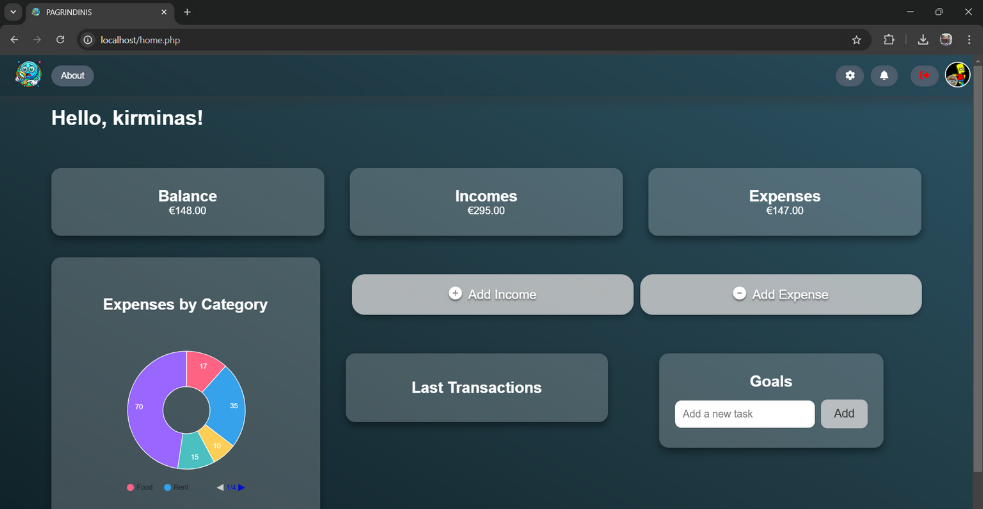

# Finansų Valdymas


Finansų Valdymas is a comprehensive financial management system designed to help users manage their personal finances efficiently.

## Table of Contents

- [About](#about)
- [Team](#team)
- [Features](#features)
- [Technologies](#technologies)
- [Installation](#installation)
- [Usage](#usage)
- [Configuration](#configuration)
- [Contributing](#contributing)
- [License](#license)
- [Images](#images)

## About

Finansų Valdymas is built using PHP, CSS, JavaScript, HTML, and Docker. It aims to provide a seamless experience in handling financial records, transactions, and reports. This system is designed to be user-friendly, secure, and efficient, making it the perfect tool for individuals.

## Team

Our team consists of 6 open-minded passionate and friendly first-year Vilnius University information system engineering students:

+ [**Benediktas**](https://github.com/OLOZ4): Team Lead, backend
+ [**Marijus**](https://github.com/supermario9000): Backend, documentation
+ [**Tauras**](https://github.com/Taurelis1): Backend
+ [**Dmitrij**](https://github.com/dmitrijpikta): Hosting, testing
+ [**Gabija**](https://github.com/Draokon): Frontend, design
+ [**Ervinas**](https://github.com/frogg-kek): Frontend, design


## Features

- User-friendly interface
- Secure authentication and authorization
- Real-time financial tracking
- Detailed financial reports
- Multi-user support
- Docker support for easy deployment
- Responsive design desktop
- Role-based access control

## Technologies

Finansų Valdymas leverages the following technologies:

- **PHP**: Server-side scripting language
- **CSS**: Styling for the web pages
- **JavaScript**: Client-side scripting for dynamic interactions
- **HTML**: Markup language for structuring web content
- **Docker**: Containerization for consistent development and deployment environments
- **Nginx**: Lightweigt web server
- **Nginx reverse proxt**: Safley expose app to the whole internet

## Installation

### Prerequisites

Ensure you have the following installed on your machine:

- Docker
- Docker Compose
- Git

### Steps

1. **Clone the repository**:
   ```bash
   git clone https://github.com/OLOZ4/finansu-valdymas.git
   cd finansu-valdymas
   ```

2. **Start the application using Docker Compose**:
   ```bash
   docker-compose up -d
   ```

3. **Access the application**:
   Open your browser and navigate to `http://localhost`.

## Usage

Once the application is running, you can:

- **Register as a new user**: Create an account to start using the system.
- **Log in to your account**: Access your dashboard and manage your finances.
- **Add, edit, and delete financial records**: Keep track of your income, expenses, and other financial activities.
- **Generate financial reports**: View detailed reports on your financial activities.
- **Manage user accounts**: Admins can manage user roles and permissions.

## Configuration

### Environment Variables

The application requires certain environment variables to be set for proper configuration. These variables are defined in the `mysql.env` file. Ensure to set the following variables:

- `MYSQL_ROOT_PASSWORD`: The root password for MySQL.
- `MYSQL_DATABASE`: The name of the database.
- `MYSQL_USER`: The database user.
- `MYSQL_PASSWORD`: The password for the database user.

### Docker Configuration

The Docker setup is defined in the `docker-compose.yml` file. This file contains the configuration for the application and database services. You can customize the settings as per your requirements.

## Contributing

We welcome contributions to improve Finansų Valdymas. To contribute, please follow these steps:

1. **Fork the repository**: Click the "Fork" button at the top of this page to create a copy of the repository under your GitHub account.
2. **Clone your fork**:
   ```bash
   git clone https://github.com/your-username/finansu-valdymas.git
   cd finansu-valdymas
   ```
3. **Create a new branch**:
   ```bash
   git checkout -b feature-branch
   ```
4. **Make your changes**: Implement your changes and commit them.
   ```bash
   git commit -m 'Add new feature'
   ```
5. **Push to the branch**:
   ```bash
   git push origin feature-branch
   ```
6. **Open a pull request**: Go to the original repository on GitHub and open a pull request to merge your changes.

Please ensure your code adheres to our [contributing guidelines](CONTRIBUTING.md).

## License

This project is licensed under the MIT License. See the [LICENSE](LICENSE) file for details.

## Images

### **Landing page**


### **Web UI**


